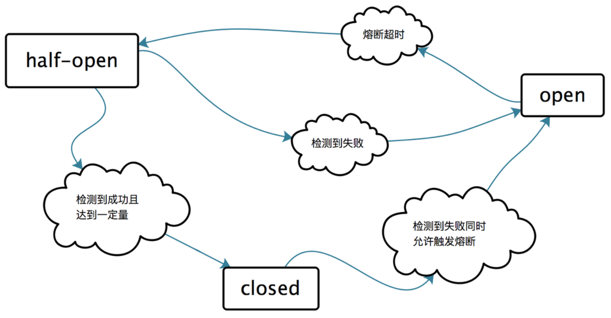

# 熔断模式

Circuit Breaker Pattern 也叫断路器模式，断路器设计模式是故障优先,一种处理失败的安全机制，防止更大的失败。

断路器类似于电路连接时防止着火的保险丝,当向电网输送了大量的电能时，会导致电线加热和燃烧，会导致供电临时中断。

熔断用于保护流量过大，是一种保护行为。

状态变化流：

一些关键角色：

## Operation Counter 操作计数器

是一个简单的计数器，记录的成功和失败的状态。

## Circuit Breaker 断路器

如果电路连续故障超过指定的阈值，它将返回一个快速错误，一段时间后，它会重试请求并记录它。

## Context

上下文用于传递参数.

参考：

<https://msdn.microsoft.com/en-us/library/dn589784.aspx>
<https://blog.csdn.net/jeffrey11223/article/details/85541923>
